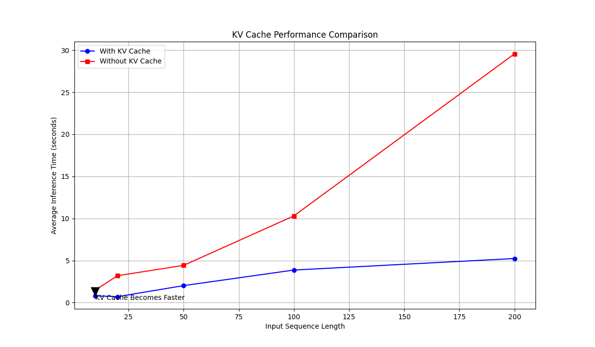

# LLM-From-Scratch
I build every core component of large language model (LLM) architectures from scratch, following Sebastian Raschka's book — covering everything from data preparation and multi-head self-attention modules to classification and instruction fine-tuning of open-source models and deployed it on AWS Sagemaker!

# Additional Concepts Implemented

## KV Caching



### 🔁 In *normal attention* (used in **training**):
- For each token `t₁, t₂, ..., tₜ`, you recompute:
  - Query `qᵢ`, Key `kᵢ`, and Value `vᵢ`
- You build full `Q`, `K`, and `V` matrices **fresh** every time
- Compute all attention scores, softmax weights, and context vectors `[c₁, c₂, ..., cₜ]` in **parallel** using full sequences (because we know all tokens ahead of time)

### ⚡ In *KV caching* (used in **inference/generation**):
- We **generate one token at a time** (we don’t know the next tokens yet)
- So we don’t recompute all `K` and `V` at each step — we **cache** (store) the previous ones to avoid redundant computation

### 🧱 Step-by-Step Example

**Sentence generation: `"The cat sat on"`**

Now you're generating the next token: `"the"`

### 🟡 Without KV Caching (Normal Inference)
At token `t₅ = "the"`:
- Recompute:
  - `k₁, k₂, k₃, k₄, k₅`
  - `v₁, v₂, v₃, v₄, v₅`
  - `q₅`
- Compute:
  - `q₅ × [k₁, k₂, k₃, k₄, k₅]ᵀ` → attention scores
  - Softmax → context vector `c₅`

❌ Inefficient — recomputing everything at each step!

### 🟢 With KV Caching (Efficient Inference)

At token `t₅ = "the"`:
- Already stored:
  - `k₁..₄`, `v₁..₄`
- Compute:
  - `q₅`, `k₅`, `v₅`
- Update caches:
  ```text
  K_cache = [k₁, ..., k₄] → [k₁, ..., k₅]
  V_cache = [v₁, ..., v₄] → [v₁, ..., v₅]
- Compute attention scores -> attention weights -> single row of context vector -> NN architecture -> softmax -> probabilities.
